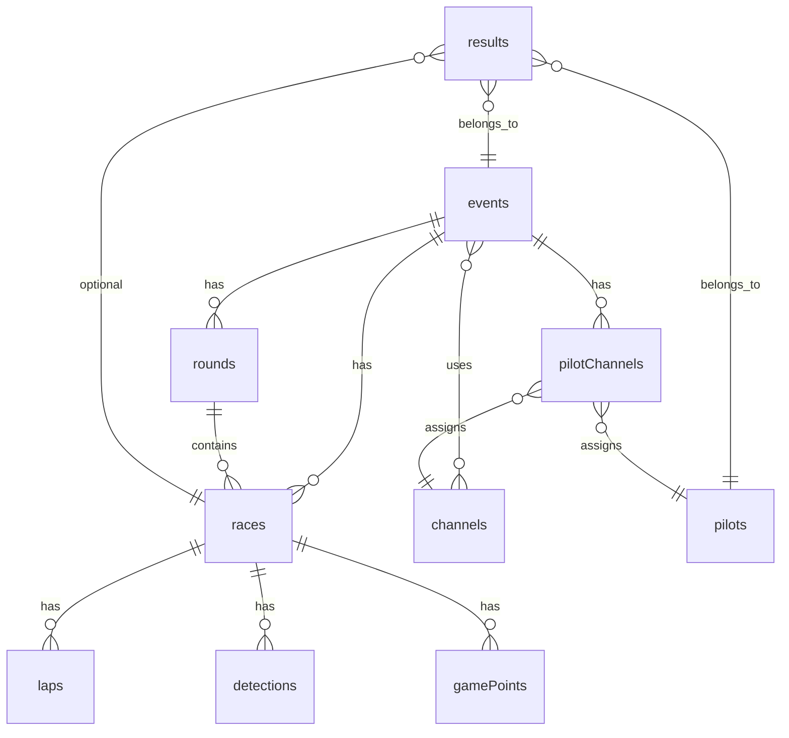

## PocketBase Data Model Mapping

This document maps the current frontend types and fetch flows to a normalized PocketBase schema suitable for long‑term querying and analytics.

References:
- Frontend types: [types/index.ts](mdc:frontend/src/types/index.ts) (see individual files it re‑exports)
- Frontend fetching: [state/atoms.ts](mdc:frontend/src/state/atoms.ts)
- PocketBase migrations guide: [Extend with Go – Migrations](https://pocketbase.io/docs/go-migrations/)

### Goals
- **Normalize** the FPVTrackside JSON into well‑structured collections.
- **Preserve source identity** for idempotent upserts and traceability.
- **Enable efficient queries** via relations and indexes.

### Source JSON overview
From the frontend fetches in [atoms.ts](mdc:frontend/src/state/atoms.ts):
- `GET /events/{eventId}/Event.json` → `RaceEvent[]` (array with a single event)
- `GET /events/{eventId}/Pilots.json` → `Pilot[]`
- `GET /httpfiles/Channels.json` → `Channel[]`
- `GET /events/{eventId}/Rounds.json` → `Round[]`
- `GET /events/{eventId}/{raceId}/Race.json` → `Race[]`
- `GET /events/{eventId}/Results.json` and per‑race `Result.json` → `ResultJson[]`

Type definitions live in:
- [event.ts](mdc:frontend/src/types/event.ts)
- [pilots.ts](mdc:frontend/src/types/pilots.ts)
- [channels.ts](mdc:frontend/src/types/channels.ts)
- [rounds.ts](mdc:frontend/src/types/rounds.ts)
- [race.ts](mdc:frontend/src/types/race.ts)
- [results.ts](mdc:frontend/src/types/results.ts)
- shared fields in [common.ts](mdc:frontend/src/types/common.ts)

### Identity and provenance strategy
- Each PB record keeps the remote FPVTrackside GUID in `sourceId` (string, unique).
- Add `source` (string; e.g., "fpvtrackside") and optional `sourceURL` for traceability.
- PB retains its own `id`; we do NOT force PB ids to match remote GUIDs.
- For deduplication: upserts key on `(source, sourceId)` with a unique index.

### Collections and fields

- **events** (RaceEvent)
  - sourceId (unique), source, sourceURL
  - name, eventType, start, end
  - laps, pbLaps, packLimit
  - raceLength, minStartDelay, maxStartDelay, primaryTimingSystemLocation
  - raceStartIgnoreDetections, minLapTime
  - lastOpened
  - track (relation → tracks) optional
  - channelColors (json[]), channelDisplayNames (json[])
  - flags (json[]), gameTypeName (string), visibility fields (booleans)

- **rounds** (Round)
  - sourceId (unique), source
  - event (relation → events)
  - name, roundNumber, eventType, roundType, valid
  - pointSummary (json), timeSummary (json)
  - order, lapCountAfterRound (bool), sheetFormatFilename, scheduledStart, gameTypeName
  - Index: (event, order)

- **pilots** (Pilot)
  - sourceId (unique), source
  - name, phonetic, firstName, lastName, sillyName, discordId
  - aircraft, catchPhrase, bestResult
  - practicePilot (bool), photoPath

- **channels** (Channel)
  - sourceId (unique), source
  - number (int), band (string), shortBand (string)
  - channelPrefix (string), frequency (int), displayName (string)

- **tracks** (Track)
  - sourceId (unique), source
  - name, length, gridSize
  - trackElements (json[])

- **races** (Race)
  - sourceId (unique), source
  - event (relation → events)
  - round (relation → rounds)
  - raceNumber (int), targetLaps (int)
  - start, end, totalPausedTime
  - primaryTimingSystemLocation
  - valid (bool), autoAssignNumbers (bool?), bracket (string)
  - Indexes: (event, round, raceNumber), (event, start)

- **pilotChannels** (PilotChannel)
  - sourceId (unique), source
  - pilot (relation → pilots)
  - channel (relation → channels)
  - event (relation → events) optional context
  - Unique composite: (event, pilot) when scoped by event

- **laps** (Lap)
  - sourceId (unique), source
  - race (relation → races)
  - detection (relation → detections) optional reference
  - lapNumber (int), lengthSeconds (float)
  - startTime, endTime
  - Index: (race, lapNumber)

- **detections** (Detection)
  - sourceId (unique), source
  - race (relation → races)
  - timingSystemIndex (int), channel (relation → channels)
  - time, peak (float), timingSystemType (string)
  - pilot (relation → pilots)
  - lapNumber (int), valid (bool), validityType (string)
  - isLapEnd (bool), raceSector (int), isHoleshot (bool)
  - Indexes: (race, pilot, lapNumber), (race, time)

- **gamePoints** (GamePoint)
  - sourceId (unique), source
  - race (relation → races)
  - channel (relation → channels)
  - pilot (relation → pilots)
  - valid (bool), time

- **results** (ResultJson)
  - sourceId (unique), source
  - event (relation → events)
  - race (relation → races) optional
  - pilot (relation → pilots)
  - points (int), position (int), valid (bool), dnf (bool)
  - resultType (string)
  - Index: (event, race, position)

Notes:
- Where the JSON embeds arrays of GUIDs (e.g., `RaceEvent.Races`), we rely on the normalized collections plus relations rather than storing denormalized arrays.
- The ingestion process will populate the relation fields by resolving foreign keys via the `sourceId` map.

### Field naming
- PB fields use lowerCamelCase for readability (e.g., `raceNumber`).
- We keep a single `sourceId` string for the remote GUID. Any remote numeric `ExternalID` is stored as `externalId` if present.

### ER diagram (high‑level)

### Indexing summary
- Unique on `(source, sourceId)` for all collections except pure join tables, where a composite unique may be preferred (e.g., `(event, pilot)` if no remote GUID exists).
- Time‑series queries: index `races.start`, `detections.time`.
- Ordering: `(round.order)` with `(event)` for grouped listings.

### Derivable/processed data
The frontend currently computes processed laps in memory (see `calculateProcessedLaps` in [atoms.ts](mdc:frontend/src/state/atoms.ts)). We can:
- keep this as a view‑level concern for now, or
- optionally add a materialized collection `processedLaps` populated by ingestion for faster queries, if needed later.

### Migration naming
See the migrations plan doc for concrete migration file names and examples.

